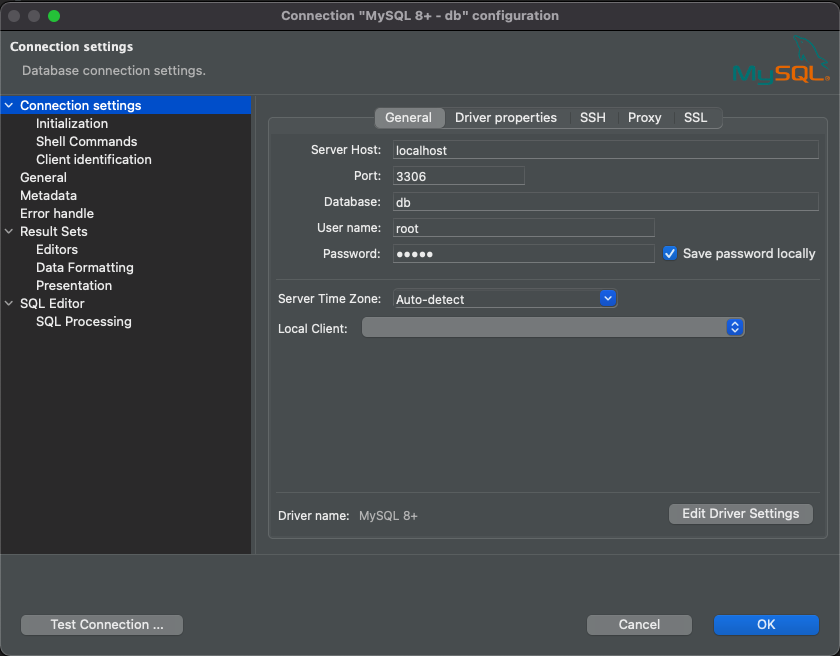

mysql
===

## Usage

### Option 1 - docker compose

Start with ```docker-compose up```

You will be able to have :

* mysql : port ```3306``` default database ```db```
* phpmysql : [http://localhost:8008/](http://localhost:8008/) (root / admin)

### Option 2 - Start & Stop command lines

Start mysql using script :

	. run_scripts.bash

It also register many bash commands :

* ```mysqlstart``` to create data folder and start mysql
* ```mysqlstop``` to stop mysql
* ```mysqlrm``` to delete mysql
* ```mysqlbash``` to open a bash cmd in mysql

### Connection URLs

Connect to mysql using port ```3306```

If you start with ```docker-compose up```, you will also have access to phpmyadmin at [http://localhost:8008/](http://localhost:8008/)

### Changing password

Edit docker-compose.yml and change the environment properties :

```
MYSQL_ROOT_PASSWORD: 'admin'

MYSQL_USER: 'username'
MYSQL_PASSWORD: 'pass'
```

## Auto init DB

Put your sql files into ```./db/init_sql``` :

* Create tables DDL scripts
* Create data DML scripts


## Manual init DB

### Init schema manually

* Login into phpmysql : [http://localhost:8008/](http://localhost:8008/) (root / admin)
* Click on the ```SQL``` tab
* Run the following table creation :

```
use db;
CREATE TABLE IF NOT EXISTS table_name(
    id BIGINT NOT NULL AUTO_INCREMENT PRIMARY KEY,
    content VARCHAR(255) NOT NULL
);
```

Enhance missing schema by adding primary key :

```
alter table <table_name> 
	add column `id` int(10) unsigned primary KEY AUTO_INCREMENT;
```

### Import data from CSV

Open a bash into docker & login into mysql :

* Login using (root/root) into MYSQL_DATABASE ```db``` : ```mysql -u root -p db```

In mysql prompt, import CSV separated with ```,``` and with CSV header (skip first row) :

```
LOAD DATA INFILE '/path/to/file.csv'  
	INTO TABLE <table_name> 
	FIELDS TERMINATED BY ',' ENCLOSED BY '"'
	LINES TERMINATED BY '\n' 
IGNORE 1 ROWS;
```

See also [https://dev.mysql.com/doc/refman/8.0/en/load-data.html](https://dev.mysql.com/doc/refman/8.0/en/load-data.html)

## Connect using DBeaver



## Troubleshooting

### Public Key Retrieval is not allowed

If you use encounter ```Public Key Retrieval is not allowed``` when connecting with DBeaver, add the following User properties :

* useSSL=false
* allowPublicKeyRetrieval=true

